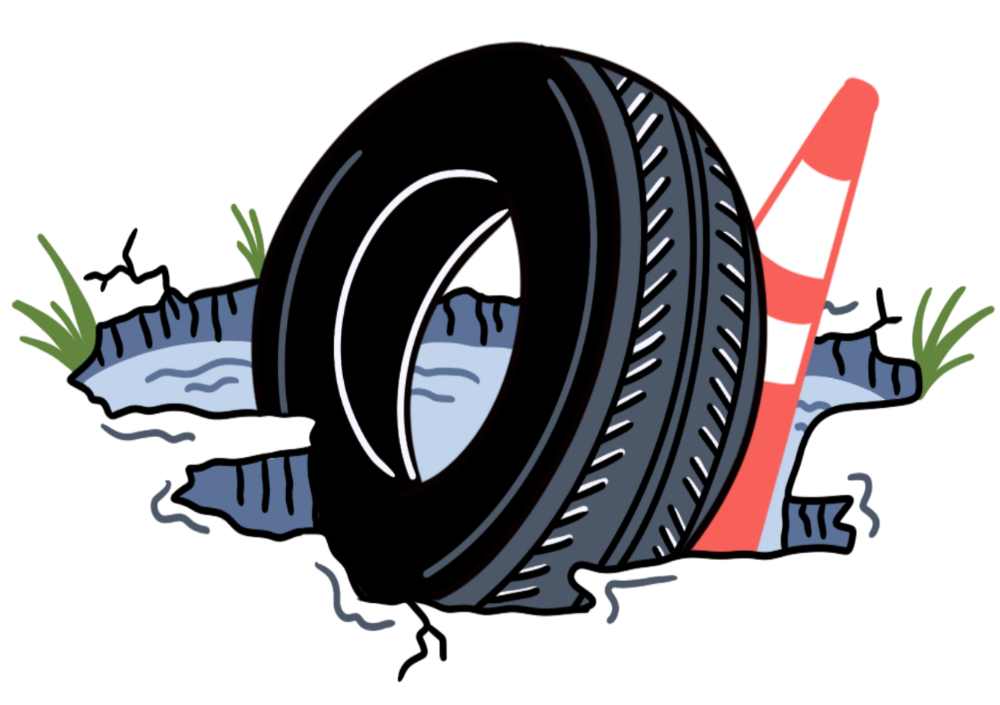

Table of Contents

- [About HoleDat](#about-holedat)
  - [Description](#description)
  - [Summary](#summary)
  - [Problem](#problem)
  - [Solution](#solution)
- [How to get started](#how-to-get-started)
  - [System requirements:](#system-requirements)
  - [Steps to Start Application](#steps-to-start-application)
- [Features](#features)
  - [Home Page](#home-page)
  - [About Page](#about-page)
  - [Map](#map)
  - [User Profile](#user-profile)
  - [Feed](#feed)
  - [Pothole Profile](#pothole-profile)
  - [Pothole Submission](#pothole-submission)
- [Call to Action](#call-to-action)
- [Tech Stack](#tech-stack)

## About HoleDat

### Description

Hole Dat is a web application that helps users report and view potholes in the city of New Orleans. The app allows users to view a map of potholes in the area, view information about specific potholes, and report new potholes. The feed feature allows users to view recently added potholes and sort them by new or unique reports, and the pothole profile feature provides detailed information about each pothole and the user who reported it. With Hole Dat, residents of New Orleans can easily report potholes and see where others have been reported around the city. This helps the city to identify and fix potholes more efficiently, improving the safety and convenience of the roads for everyone. Whether you're a driver looking to avoid damaging your vehicle or a pedestrian trying to navigate the city, Hole Dat is a valuable resource for staying informed about potholes in the area.

### Summary

Hole Dat is a web application that provides a comprehensive pothole tracking solution for the city of New Orleans. With this application, users can easily report and view potholes in the area through an interactive map interface. The feed feature allows users to stay up-to-date on newly reported potholes, and the pothole profile feature provides detailed information about individual potholes and the users who reported them. This application is built on top of a robust and scalable backend, and utilizes cutting-edge web development technologies to deliver a seamless user experience. Hole Dat is a powerful tool for aggregating and addressing potholes in the city, and is essential for any infrastructure management strategy.

### Problem

New Orleans is facing a significant road infrastructure challenge due to multiple factors such as sea level, tree root growth, and environmental elements. These issues have resulted in a high rate of road degradation, with potholes being a common issue. Unfortunately, there is currently no system in place to aggregate and report pothole data, making it difficult to efficiently track and address this problem. This lack of pothole tracking functionality represents a gap in our current road maintenance pipeline, and we need to implement a solution to bridge this gap.

### Solution

To address the road infrastructure problem in New Orleans, we propose the development of a web-based pothole tracking application. This application will allow users to easily report and view potholes in the area through an interactive map interface and feed. The feed feature will provide real-time updates on newly reported potholes, and the pothole profile feature will offer detailed information about individual potholes and the users who reported them. The application features a robust and secure backend, implemented using a range of state-of-the-art programming languages and frameworks. Overall, our proposed solution will provide a comprehensive and user-friendly platform for aggregating and addressing potholes in the city of New Orleans, and will serve as a valuable asset for any infrastructure management strategy.

## How to get started

### System requirements:

- Node v18.12.1
- Postgres 0.0.1

### Steps to Start Application

1. Make copy of ENV
2. Add coordinating variables to .env
3. npm install
4. npm run build
5. npm run server

## Features

### Home Page

Here you will find various statistics about our user base and reported potholes. The global navigation bar at the top of the page allows you to access other areas of the site and also provides the option to toggle between light and dark mode. We hope you find this page informative and user-friendly.

### About Page

Our "About" page features real-time updated trackers that show the number of users signed up for HoleDat and the number of potholes submitted through the app. This gives you a sense of the impact that HoleDat is having in your community and helps you stay informed about the status of pothole repairs. We also have a range of user statistics on the "About" page, including charts that show the number of potholes reported by neighborhood and the overall trend of pothole repair efforts over time. These statistics give you a deeper understanding of the pothole situation in New Orleans and how HoleDat is helping to address it.

### Map

The map feature of our application is a central hub for pothole tracking and reporting. It allows users to view an interactive map of the city, with each pothole represented by a marker. By clicking on a marker, users can view information about the pothole and the user who reported it. Additionally, users can report new potholes by clicking on an empty area of the map and filling out a form. The map feature is powered by the Mapbox GL and React Map GL libraries, providing a smooth and responsive user experience. With the map feature, our application provides a comprehensive and intuitive platform for pothole tracking and reporting.

### User Profile

The user profile page in the holeDat app allows users to view a list of all the pothole images they have uploaded to the app. It also includes a feature for users to edit their name as it appears in the app. This page provides users with an overview of their contributions to the app and allows them to personalize their user experience.

### Feed

The feed feature is a paginated display of pothole images uploaded by users, along with accompanying badges. Users can click on a pothole image or badge to view the corresponding profile page. The feed also includes a filtering system that allows users to sort the displayed images by various criteria such as "old," "new," "fixed," and "not fixed." This feature is implemented using state-of-the-art pagination and filtering techniques, and provides a dynamic and user-friendly way for users to browse and interact with reported potholes.

### Pothole Profile

The Pothole Profile is a module within the holeDat app that enables users to submit and monitor potholes within their region. By creating a Pothole Profile, users can input precise data about the location and dimensions of the pothole, as well as any damages to their vehicle. They also have the option to include photographs of the pothole for visual reference. This data is saved in the Pothole Profile and can be retrieved by other users within the app. By generating a Pothole Profile, users can contribute to the enhancement of road safety and quality in their community.

### Pothole Submission

The pothole submission page is a simple and intuitive interface that allows users to report new potholes in the web-app. To submit a pothole, users simply need to fill out a form with the pothole's location and any additional information they would like to provide. Once the form is submitted, the new pothole will be added to the map and visible to all users. This feature is designed to be quick and easy to use, ensuring that users can quickly and efficiently report potholes and contribute to the overall effort to improve road infrastructure in the city.

## Call to Action

If you are tired of navigating pothole-ridden roads in New Orleans and want to be part of the solution, then look no further! Our pothole tracking application empowers users to easily report and view potholes in the area, and helps city officials prioritize repairs and improve road infrastructure. Don't wait any longer, join the fight against potholes!

## Tech Stack

- Languages: JavaScript, TypeScript
- Bundler: Webpack
- Transpiler: Babel
- Package Manager: npm
- Framework: Express, React
- Linting: ESLint, TypeScript ESLint
- Cloud Infrastructure: AWS/EC2/RDS
- Data Persistence: PostgreSQL, Sequelize
- Authentication: Passport, Google OAuth
- Styling: Sass, Bootstrap
- Mapping: Mapbox GL, React Map GL
- Charting: Chart.js
- Image Management: Cloudinary
- Utilities: fs, fs-extra, form-data, multer, dotenv, concurrently, rimraf, moment
- Type Definitions: @types/node, @types/express, @types/express-session, @types/passport, @types/passport-google-oauth20, @types/react, @types/react-dom, @types/styled-components
